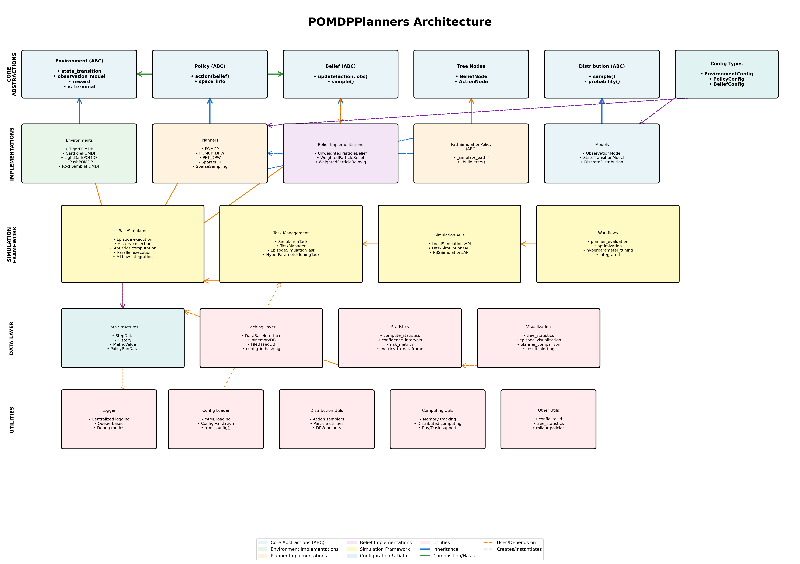
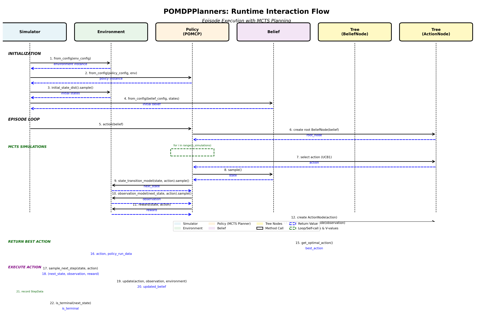

# POMDPPlanners Architecture Overview

This document provides a comprehensive overview of the POMDPPlanners architecture, showing how different components interact to enable POMDP planning and simulation.

## Table of Contents
1. [Architecture Diagrams](#architecture-diagrams)
2. [Core Concepts](#core-concepts)
3. [Component Layers](#component-layers)
4. [Key Design Patterns](#key-design-patterns)
5. [Component Relationships](#component-relationships)
6. [Runtime Execution Flow](#runtime-execution-flow)
7. [Extension Points](#extension-points)

---

## Architecture Diagrams

### Component Architecture


The architecture diagram shows the five main layers of the system and how components relate to each other through inheritance, composition, and usage relationships.

### Interaction Flow


The interaction flow diagram illustrates the runtime sequence of method calls during a typical POMDP planning episode, from initialization through action selection and execution.

---

## Core Concepts

### POMDP Framework
POMDPPlanners implements the Partially Observable Markov Decision Process (POMDP) framework, which consists of:

- **States (S)**: Internal states of the world (partially observable)
- **Actions (A)**: Available actions the agent can take
- **Observations (O)**: Partial information about the state
- **Transition Model (T)**: P(s' | s, a) - probability of transitioning to state s' given state s and action a
- **Observation Model (Z)**: P(o | s', a) - probability of observation o given next state s' and action a
- **Reward Function (R)**: R(s, a) - immediate reward for taking action a in state s
- **Belief (b)**: Probability distribution over states representing agent's knowledge

### Key Abstractions

The codebase provides abstract base classes (ABCs) that define the core interfaces:

1. **Environment**: Defines the POMDP environment (T, Z, R functions)
2. **Policy**: Defines how to select actions given beliefs
3. **Belief**: Represents probability distributions over states
4. **Distribution**: Generic probability distribution interface
5. **Tree Nodes**: Data structures for tree-based planning algorithms

---

## Component Layers

The architecture is organized into five distinct layers:

### 1. Core Abstractions Layer
**Purpose**: Define interfaces and contracts for all components

**Key Components**:
- `Environment` (ABC) - POMDP environment interface
- `Policy` (ABC) - Planning/policy interface
- `Belief` (ABC) - Belief representation interface
- `Distribution` (ABC) - Probability distribution interface
- `BeliefNode`, `ActionNode` - Tree structures for MCTS
- `EnvironmentConfig`, `PolicyConfig`, `BeliefConfig` - Configuration data structures

**Design Philosophy**:
- Abstract base classes force implementation of required methods
- Type hints and space information ensure compatibility
- Config-based creation enables runtime flexibility

### 2. Implementation Layer
**Purpose**: Concrete implementations of core abstractions

**Environments**:
- `TigerPOMDP` - Classic two-door tiger problem
- `LightDarkPOMDP` - Navigation with position-dependent observation noise
- `CartPolePOMDP`, `MountainCarPOMDP` - Gym-based environments
- `PushPOMDP` - Object manipulation
- `RockSamplePOMDP` - Mars rover benchmark
- `SafeAntVelocityPOMDP` - Safety-constrained navigation

**Planners**:
- `POMCP` - Partially Observable Monte Carlo Planning
- `POMCP_DPW` - POMCP with Double Progressive Widening
- `PFT_DPW` - Particle Filter Trees with DPW
- `SparsePFT` - Sparse Particle Filter Trees
- `SparseSamplingPlanner` - Sparse sampling algorithm
- `DiscreteActionSequencesPlanner` - Open-loop planning

**Beliefs**:
- `UnweightedParticleBelief` - Uniform particle filter
- `WeightedParticleBelief` - Weighted particle filter
- `WeightedParticleBeliefReinvigoration` - With particle diversity maintenance

**Models**:
- `ObservationModel` - Generates observations from states
- `StateTransitionModel` - Generates next states from state-action pairs
- `DiscreteDistribution` - Discrete probability distributions

### 3. Simulation Framework Layer
**Purpose**: Orchestrate experiments, manage execution, and collect results

**Components**:
- `BaseSimulator` - Main simulation orchestrator
  - Episode execution and history collection
  - Parallel execution support
  - MLflow experiment tracking
  - Statistical analysis

- `Task Management` - Distributed computing infrastructure
  - `SimulationTask` - Abstract task interface
  - `EpisodeSimulationTask` - Single episode execution
  - `HyperParameterTuningTask` - HPO experiments
  - `TaskManager` - Task scheduling and execution

- `Simulation APIs` - Execution backends
  - `LocalSimulationsAPI` - Local sequential execution
  - `DaskSimulationsAPI` - Dask distributed execution
  - `PBSSimulationsAPI` - PBS/HPC cluster execution

- `Workflows` - High-level experiment pipelines
  - Planner evaluation workflows
  - Hyperparameter optimization workflows
  - Integrated optimization + evaluation workflows

### 4. Data Layer
**Purpose**: Data structures, persistence, and analysis

**Components**:
- `StepData` - Single timestep data (state, action, observation, reward)
- `History` - Complete episode history with timing information
- `PolicyRunData` - Policy-specific metadata
- `MetricValue` - Environment-specific metrics
- `DataBaseInterface` - Abstract caching interface
  - In-memory caching
  - File-based persistent caching
  - External database support
- `Statistics` - Statistical analysis functions
  - Confidence intervals
  - Risk metrics (CVaR, worst-case)
  - Performance aggregation
- `Visualization` - Plotting and result visualization
  - Tree statistics visualization
  - Episode trajectory plotting
  - Comparative performance plots

### 5. Utilities Layer
**Purpose**: Cross-cutting concerns and helper functions

**Components**:
- **Logger** - Centralized logging with queue-based support
- **Config Loader** - YAML configuration file parsing and validation
- **Config to ID** - Deterministic hashing for reproducibility
- **Distribution Utils** - Action samplers, particle utilities
- **DPW Helpers** - Double progressive widening utilities
- **Memory Tracker** - Memory profiling and monitoring
- **Distributed Computing** - Ray/Dask integration helpers
- **Tree Statistics** - Tree analysis and metrics
- **Rollout Policies** - Default policies for simulation

---

## Key Design Patterns

### 1. Abstract Base Classes (ABC Pattern)
**Purpose**: Define contracts and enforce implementation

```python
class Environment(ABC):
    @abstractmethod
    def state_transition_model(self, state, action) -> StateTransitionModel:
        """Must be implemented by all environments"""
        pass
```

**Benefits**:
- Clear interface contracts
- Type safety and IDE support
- Runtime enforcement of required methods

### 2. Factory Pattern (from_config)
**Purpose**: Dynamic object creation from configuration

```python
@classmethod
def from_config(cls, config: EnvironmentConfig) -> 'Environment':
    """Create environment instance from config"""
    class_type = get_class_from_name(config.class_name)
    return class_type(**config.params)
```

**Benefits**:
- Runtime flexibility
- Configuration-driven experiments
- Easy serialization/deserialization

### 3. Config-Based Hashing
**Purpose**: Deterministic identifiers for caching and reproducibility

```python
@property
def config_id(self) -> str:
    """Generate deterministic ID from configuration"""
    return generate_id_from_config(self.config)
```

**Benefits**:
- Automatic result caching
- Reproducible experiments
- Configuration-based equality

### 4. Composition over Inheritance
**Purpose**: Flexible component relationships

```python
class Policy(ABC):
    def __init__(self, environment: Environment):
        self.environment = environment  # Composition
```

**Benefits**:
- Loose coupling
- Easier testing
- Runtime flexibility

### 5. Strategy Pattern (Policies)
**Purpose**: Interchangeable planning algorithms

```python
class POMCP(PathSimulationPolicy):
    def action(self, belief: Belief) -> Tuple[Action, PolicyRunData]:
        """POMCP-specific action selection"""
        pass

class PFT_DPW(PathSimulationPolicy):
    def action(self, belief: Belief) -> Tuple[Action, PolicyRunData]:
        """PFT-DPW-specific action selection"""
        pass
```

**Benefits**:
- Algorithm comparison
- Easy addition of new planners
- Consistent interface

### 6. Template Method Pattern (PathSimulationPolicy)
**Purpose**: Define algorithm skeleton, customize specific steps

```python
class PathSimulationPolicy(Policy, ABC):
    def action(self, belief: Belief):
        """Template method - same for all MCTS variants"""
        tree = self._build_tree(belief)
        for _ in range(self.num_simulations):
            self._simulate_path(depth=0)  # Subclass-specific
        return self._get_best_action(tree)

    @abstractmethod
    def _simulate_path(self, depth: int):
        """Customization point for different MCTS variants"""
        pass
```

**Benefits**:
- Code reuse
- Consistent behavior
- Clear extension points

---

## Component Relationships

### Inheritance Hierarchies

**Environment Hierarchy**:
```
Environment (ABC)
└── DiscreteActionsEnvironment (ABC)
    ├── TigerPOMDP
    ├── CartPolePOMDP
    ├── LightDarkPOMDP
    ├── PushPOMDP
    └── [other discrete environments]
```

**Policy Hierarchy**:
```
Policy (ABC)
├── PathSimulationPolicy (ABC)
│   ├── POMCP
│   ├── POMCP_DPW
│   ├── POMCPOW
│   ├── PFT_DPW
│   └── SparsePFT
├── SparseSamplingDiscreteActionsPlanner
└── DiscreteActionSequencesPlanner
```

**Belief Hierarchy**:
```
Belief (ABC)
├── UnweightedParticleBelief
│   └── UnweightedParticleBeliefStateUpdate
└── WeightedParticleBelief
    ├── WeightedParticleBeliefReinvigoration
    └── WeightedParticleBeliefStateUpdate
```

### Composition Relationships

- **Policy → Environment**: Every policy contains an environment instance
- **Policy → Belief**: Policies operate on belief states
- **BeliefNode → Belief**: Tree nodes maintain belief states
- **ActionNode → Action**: Tree nodes store actions
- **Simulator → Environment, Policy, Belief**: Simulator orchestrates all components
- **History → StepData**: Episodes collect step-by-step data

### Usage Dependencies

- **Policy uses Environment**: For state transitions and observations during planning
- **Belief uses Environment**: For belief updates via transition and observation models
- **MCTS Planners use Tree Nodes**: To build and navigate search trees
- **Simulator uses TaskManager**: For distributed execution
- **Workflows use SimulationAPIs**: To execute experiments
- **All components use Config**: For creation and configuration

---

## Runtime Execution Flow

### Episode Execution Sequence

#### 1. Initialization Phase
```
Simulator
  └─> Environment.from_config(env_config)
        └─> Returns: environment instance
  └─> Policy.from_config(policy_config, environment)
        └─> Returns: policy instance
  └─> Environment.initial_state_dist().sample()
        └─> Returns: initial states
  └─> Belief.from_config(belief_config, states)
        └─> Returns: initial belief
```

#### 2. Episode Loop
```
For each timestep until terminal:

  ┌─ Action Selection (MCTS Planning) ─────────────────┐
  │                                                     │
  │ Policy.action(belief)                              │
  │   └─> Create root BeliefNode(belief)              │
  │   └─> For i in range(num_simulations):            │
  │         └─> _simulate_path():                      │
  │               1. Select action via UCB1            │
  │               2. Sample state from belief          │
  │               3. Sample next state via             │
  │                  environment.state_transition()    │
  │               4. Sample observation via            │
  │                  environment.observation_model()   │
  │               5. Compute reward via                │
  │                  environment.reward()              │
  │               6. Create/update tree nodes          │
  │               7. Backpropagate values              │
  │   └─> Return best action from tree                │
  │                                                     │
  └─────────────────────────────────────────────────────┘

  ┌─ Action Execution ──────────────────────────────────┐
  │                                                     │
  │ Environment.sample_next_step(state, action)        │
  │   └─> Sample next state                            │
  │   └─> Sample observation                           │
  │   └─> Compute reward                               │
  │   └─> Returns: (next_state, observation, reward)   │
  │                                                     │
  └─────────────────────────────────────────────────────┘

  ┌─ Belief Update ─────────────────────────────────────┐
  │                                                     │
  │ Belief.update(action, observation, environment)    │
  │   └─> For each particle:                           │
  │         1. Sample next state                       │
  │         2. Compute observation probability         │
  │         3. Update particle weight                  │
  │   └─> Resample if needed                           │
  │   └─> Returns: updated belief                      │
  │                                                     │
  └─────────────────────────────────────────────────────┘

  ┌─ Recording ─────────────────────────────────────────┐
  │                                                     │
  │ Record StepData(state, action, next_state,         │
  │                observation, reward, belief)         │
  │                                                     │
  └─────────────────────────────────────────────────────┘

  ┌─ Terminal Check ────────────────────────────────────┐
  │                                                     │
  │ Environment.is_terminal(next_state)                │
  │   └─> Returns: is_terminal                         │
  │                                                     │
  └─────────────────────────────────────────────────────┘
```

#### 3. Post-Episode Analysis
```
Simulator
  └─> Collect History from StepData
  └─> Compute Statistics
        └─> Mean return, std dev, confidence intervals
  └─> Generate Visualizations
        └─> Episode trajectory, tree statistics
  └─> Log to MLflow (if enabled)
```

### MCTS Tree Building Details

The MCTS planning phase builds a search tree incrementally:

```
BeliefNode (root)
  ├─ ActionNode (action_1)
  │    ├─ BeliefNode (obs_1) [weight based on P(obs|belief)]
  │    │    └─ ActionNode (action_1.1)
  │    │         └─ ...
  │    └─ BeliefNode (obs_2)
  │         └─ ...
  ├─ ActionNode (action_2)
  │    └─ ...
  └─ ActionNode (action_3)
       └─ ...
```

**Node Selection**: UCB1 balances exploration and exploitation
**Node Expansion**: Progressive widening controls tree growth
**Value Backpropagation**: Q-values updated from leaf to root

---

## Extension Points

### Adding New Environments

1. **Inherit from base class**:
   ```python
   class MyEnvironment(DiscreteActionsEnvironment):
       pass
   ```

2. **Implement required methods**:
   - `state_transition_model(state, action)`
   - `observation_model(next_state, action)`
   - `reward(state, action)`
   - `is_terminal(state)`
   - `initial_state_dist()`
   - `initial_observation_dist()`
   - `is_equal_observation(obs1, obs2)`
   - `get_actions()` (for discrete actions)

3. **Define space information**:
   ```python
   def __init__(self):
       space_info = SpaceInfo(
           action_space=SpaceType.DISCRETE,
           observation_space=SpaceType.CONTINUOUS
       )
       super().__init__(space_info=space_info)
   ```

4. **Add configuration support**:
   ```yaml
   # config.yaml
   environment:
     class_name: "MyEnvironment"
     params:
       discount_factor: 0.95
       param1: value1
   ```

### Adding New Planners

1. **Choose base class**:
   - `PathSimulationPolicy` for MCTS-based planners
   - `Policy` for other approaches

2. **Implement required methods**:
   ```python
   class MyPlanner(PathSimulationPolicy):
       def _simulate_path(self, depth: int) -> Optional[float]:
           """Implement your MCTS simulation logic"""
           # 1. Select action
           # 2. Sample state from belief
           # 3. Get next state and observation from environment
           # 4. Update tree
           # 5. Return value estimate
           pass
   ```

3. **Define space compatibility**:
   ```python
   @classmethod
   def get_space_info(cls) -> PolicySpaceInfo:
       return PolicySpaceInfo(
           action_space=SpaceType.DISCRETE,
           observation_space=SpaceType.CONTINUOUS
       )
   ```

### Adding New Belief Representations

1. **Inherit from Belief**:
   ```python
   class MyBelief(Belief):
       pass
   ```

2. **Implement required methods**:
   ```python
   def update(self, action, observation, pomdp: Environment) -> 'MyBelief':
       """Update belief given action and observation"""
       pass

   def sample(self) -> Any:
       """Sample a state from the belief"""
       pass
   ```

3. **Add initialization support**:
   ```python
   @classmethod
   def from_config(cls, config: BeliefConfig, **kwargs) -> 'MyBelief':
       return cls(**config.params, **kwargs)
   ```

### Adding New Task Managers

1. **Implement DataBaseInterface**:
   ```python
   class MyDatabase(DataBaseInterface):
       def get(self, key): pass
       def set(self, key, value): pass
   ```

2. **Implement TaskManager**:
   ```python
   class MyTaskManager(TaskManager):
       def run_tasks(self, tasks): pass
   ```

3. **Create SimulationAPI**:
   ```python
   class MySimulationAPI(SimulationsAPIInterface):
       def __init__(self):
           self.task_manager = MyTaskManager()
           self.database = MyDatabase()
   ```

---

## Summary

The POMDPPlanners architecture provides:

✅ **Clean separation of concerns** through layered design
✅ **Extensibility** via abstract base classes and interfaces
✅ **Flexibility** through configuration-based creation
✅ **Reproducibility** via deterministic config hashing
✅ **Scalability** through distributed execution support
✅ **Type safety** with comprehensive type hints
✅ **Testability** with dependency injection and composition

The framework enables both research (easy algorithm comparison) and industrial applications (reliable, tested implementations) while maintaining code quality and maintainability.

For more details on specific components, see:
- [CLAUDE.md](CLAUDE.md) - Development guidelines and project overview
- [docs/](docs/) - Detailed API documentation
- [tests/](POMDPPlanners/tests/) - Test suite with usage examples
