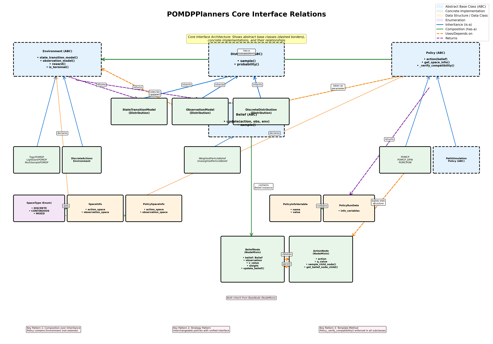

# Core Interface Relations Graph - Detailed Explanation

This document explains the core interface relations graph (`core_interface_relations.png`), which visualizes the architecture of the POMDPPlanners core module.



---

## Graph Overview

The graph shows how the fundamental abstractions in POMDPPlanners interact, organized into five main layers:

1. **Abstract Base Classes (Top)** - Dashed borders indicate abstract classes
2. **Distribution Specializations (Upper-Middle)** - Concrete implementations of Distribution
3. **Concrete Implementations (Middle)** - Specific environments, policies, and beliefs
4. **Data Structures (Lower-Middle)** - Supporting data classes and enums
5. **Tree Structures (Bottom)** - MCTS search tree node types

---

## Key Components

### Abstract Base Classes (Dashed Borders)

#### Distribution (ABC)
- **Location**: Top center
- **Purpose**: Abstract interface for all probability distributions
- **Methods**: `sample()`, `probability()`
- **Why it matters**: Provides unified interface for stochastic processes (transitions, observations)

#### Environment (ABC)
- **Location**: Top left
- **Purpose**: Formalizes POMDP tuple (S, A, O, T, Z, R, γ)
- **Key Methods**:
  - `state_transition_model()` → Returns StateTransitionModel
  - `observation_model()` → Returns ObservationModel
  - `reward()` → Returns float
  - `is_terminal()` → Returns bool
- **Why it matters**: Separates problem definition from solution methods

#### Policy (ABC)
- **Location**: Top right
- **Purpose**: Defines planning/decision interface
- **Key Methods**:
  - `action(belief)` → Returns (action, PolicyRunData)
  - `get_space_info()` → Returns PolicySpaceInfo
  - `_verify_compatibility()` → Checks space type matching
- **Why it matters**: Enables interchangeable planning algorithms

#### Belief (ABC)
- **Location**: Center
- **Purpose**: Represents probability distribution over states
- **Key Methods**:
  - `update(action, observation, environment)` → Returns updated Belief
  - `sample()` → Returns state
- **Why it matters**: Encapsulates sufficient statistic for decision-making under partial observability

---

## Relationship Types (Arrows)

### Blue Solid Lines: Inheritance (is-a)
- Shows class hierarchy
- Examples:
  - StateTransitionModel inherits from Distribution
  - WeightedParticleBelief inherits from Belief
  - POMCP inherits from PathSimulationPolicy which inherits from Policy

### Green Solid Lines: Composition (has-a)
- Shows containment relationships
- **Most Important**: Policy → Environment (thick green line)
  - Policy **contains** an Environment instance
  - This is composition, not inheritance
  - Enables policies to query environment dynamics during planning

### Orange Dashed Lines: Uses/Depends on
- Shows runtime dependencies
- Examples:
  - Belief.update() uses Environment (to get transition/observation models)
  - Policy.action() takes Belief as parameter
  - MCTS policies build tree structures

### Purple Dashed Lines: Returns
- Shows what methods return
- Examples:
  - Environment.state_transition_model() returns StateTransitionModel
  - Policy.action() returns PolicyRunData

---

## Critical Design Patterns (Highlighted at Bottom)

### Pattern 1: Composition over Inheritance
**Location**: Bottom left annotation

Policy **contains** Environment (not extends). This design choice enables:
- Policies to work with any environment conforming to the interface
- Easy testing by injecting mock environments
- Runtime flexibility to change environments

### Pattern 2: Strategy Pattern
**Location**: Bottom center annotation

Policies are interchangeable strategies:
- All policies implement same interface: `action(belief)`
- Can swap POMCP for PFT_DPW without changing surrounding code
- Enables systematic algorithm comparison

### Pattern 3: Template Method
**Location**: Bottom right annotation

`Policy._verify_compatibility()` enforced in all subclasses:
- Base class constructor calls verification
- Prevents invalid environment-policy pairings at runtime
- Ensures space type compatibility (discrete vs continuous)

---

## Key Data Flow Paths

### 1. Planning Cycle (During action selection)
```
Policy.action(belief)
  ├─> Policy queries Environment.state_transition_model()
  │   └─> Returns StateTransitionModel (Distribution)
  ├─> Policy queries Environment.observation_model()
  │   └─> Returns ObservationModel (Distribution)
  └─> Returns (action, PolicyRunData)
      └─> PolicyRunData contains PolicyInfoVariable metrics
```

### 2. Belief Update Cycle
```
Belief.update(action, observation, environment)
  ├─> Uses Environment.state_transition_model() for prediction
  ├─> Uses Environment.observation_model() for correction
  └─> Returns updated Belief
```

### 3. Tree Building (MCTS planners)
```
Policy builds tree:
  ├─> Creates BeliefNode (contains Belief instance)
  └─> Creates ActionNode children
      └─> Creates BeliefNode children (alternating structure)
```

---

## Space Type System (Bottom Left)

### SpaceType Enum
- **DISCRETE**: Finite, countable spaces
- **CONTINUOUS**: Real-valued spaces
- **MIXED**: Combination of discrete and continuous

### SpaceInfo & PolicySpaceInfo
- Both contain: `action_space`, `observation_space`
- **SpaceInfo**: Declared by Environment
- **PolicySpaceInfo**: Declared by Policy.get_space_info()

### Compatibility Checking
The system automatically verifies:
- ✅ Discrete-action policy + Discrete-action environment = OK
- ✅ Continuous-action policy + Discrete-action environment = OK (can discretize)
- ❌ Discrete-action policy + Continuous-action environment = ERROR

This happens in `Policy._verify_environment_compatibility()` during policy construction.

---

## Distribution Hierarchy (Upper Middle)

### Why separate StateTransitionModel and ObservationModel?

Both inherit from Distribution but serve different purposes:

**StateTransitionModel**:
- Input: current state, action
- Output: next state distribution
- Represents: T(s' | s, a)

**ObservationModel**:
- Input: next state, action
- Output: observation distribution
- Represents: Z(o | s', a)

**DiscreteDistribution**:
- General-purpose discrete probability distribution
- Used for initial state distributions, action sampling, etc.

---

## Tree Structure (Bottom)

### BeliefNode and ActionNode

MCTS planners build search trees with alternating node types:

```
BeliefNode (root)
 ├─ ActionNode (action_1)
 │   ├─ BeliefNode (obs_1)
 │   │   └─ ActionNode (action_1_1)
 │   └─ BeliefNode (obs_2)
 └─ ActionNode (action_2)
```

**BeliefNode**:
- Contains: Belief instance, observation, v_value, weight
- Represents: State belief after receiving observation
- Methods: `update_belief()` to propagate forward

**ActionNode**:
- Contains: Action, q_value
- Represents: Taking an action from a belief state
- Methods: `sample_child_node()`, `get_belief_node_child()`

Both inherit from `BaseNode` (via `NodeMixin`), providing:
- Parent-child relationships
- Tree traversal
- Depth calculation

---

## Concrete Implementations (Middle Layer)

### Environments
- **TigerPOMDP, LightDarkPOMDP, RockSamplePOMDP**: Specific benchmark problems
- **DiscreteActionsEnvironment**: Specialized base class for discrete actions
  - Adds `get_actions()` method
  - Most planning algorithms require discrete actions

### Policies
- **POMCP, POMCP_DPW, POMCPOW**: MCTS variants
- **PathSimulationPolicy (ABC)**: Base class for MCTS planners
  - Implements tree building loop
  - Subclasses override `_simulate_path()`

### Beliefs
- **WeightedParticleBelief**: For continuous observation spaces
  - Maintains weighted particles
  - Resamples when effective sample size drops
- **UnweightedParticleBelief**: For discrete observation spaces
  - Uniform weight particles
  - Simpler update mechanism

---

## How to Use This Graph

### For New Users
1. Start with the **Abstract Base Classes** (top, dashed borders)
2. Understand the **key relationships** (especially Policy → Environment)
3. See how **concrete implementations** (middle) specialize abstractions

### For Implementing New Components

**New Environment**:
1. Inherit from `Environment` (or `DiscreteActionsEnvironment`)
2. Implement: `state_transition_model()`, `observation_model()`, `reward()`
3. Define `SpaceInfo` in constructor

**New Policy**:
1. Inherit from `Policy` (or `PathSimulationPolicy` for MCTS)
2. Implement: `action(belief)`, `get_space_info()`
3. System automatically verifies compatibility with environment

**New Belief**:
1. Inherit from `Belief`
2. Implement: `update(action, observation, environment)`, `sample()`
3. Can leverage environment's transition/observation models

### For Research
- The graph shows **extension points** (abstract classes)
- The **composition relationship** (Policy → Environment) enables easy experimentation
- The **space type system** ensures valid algorithm-environment pairings

---

## Comparison with Traditional POMDP Formalism

### Mathematical POMDP Tuple: (S, A, O, T, Z, R, γ)

| Math Symbol | Code Representation |
|-------------|-------------------|
| S (States) | Implicit in Environment |
| A (Actions) | Returned by Environment.get_actions() |
| O (Observations) | Returned by Environment.observation_model() |
| T (Transitions) | Environment.state_transition_model() → StateTransitionModel |
| Z (Observations) | Environment.observation_model() → ObservationModel |
| R (Rewards) | Environment.reward() |
| γ (Discount) | Policy.discount_factor |
| b (Belief) | Belief class |
| π (Policy) | Policy class |

The architecture directly maps mathematical formalism to code interfaces!

---

## Advanced: Configuration-Based Creation

All core classes support `from_config()` factory methods (not shown in graph to reduce clutter):

```python
# Configuration specifies class and parameters
config = {
    'class_name': 'POMCP',
    'params': {'depth': 20, 'exploration_constant': 1.0}
}

# Runtime instantiation
policy = Policy.from_config(config)
```

This enables:
- Dynamic algorithm selection from YAML files
- Reproducible experiments via config files
- Systematic hyperparameter sweeps

Each instance also has `config_id` property (SHA-256 hash) for caching and deduplication.

---

## Summary

The core interface graph reveals a **principled architecture** where:

1. **Abstract base classes** define contracts (Environment, Policy, Belief, Distribution)
2. **Composition** (not inheritance) connects major components
3. **Space type system** ensures compatibility
4. **Clean separation** between problem (Environment) and solution (Policy)
5. **Extensibility** through well-defined interfaces
6. **Type safety** through runtime verification

This architecture enables researchers to:
- Implement new algorithms without modifying environments
- Add new environments without touching planning algorithms
- Systematically compare algorithms on benchmark problems
- Extend the framework with custom components

The graph serves as a **reference architecture** for understanding how POMDP planning systems can be designed for both **mathematical rigor** and **practical extensibility**.
